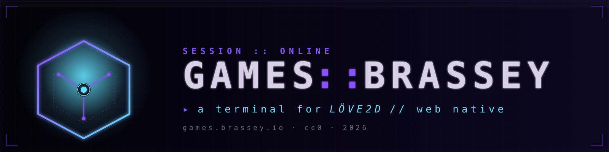
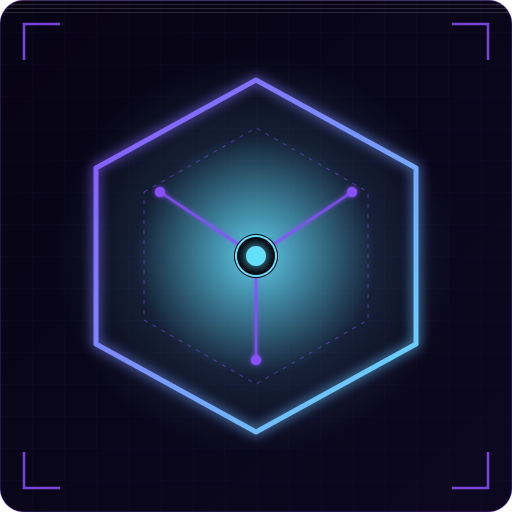

# games.brassey.io

<p align="center">
  
</p>

<p align="center">
  <a href="https://games.brassey.io"></a>
  <a href="./LICENSE"></a>
  
  
</p>

A dark-terminal portal for LÖVE2D games, running in the browser via
[love.js](https://github.com/Davidobot/love.js). Features: GitHub sign-in,
cross-device save sync, a global chat channel spanning every title,
playtime telemetry, public per-user profiles, synthesized UI SFX, and a
procedural ambient soundtrack.

Deployed at [games.brassey.io](https://games.brassey.io). Hosted on Vercel;
Postgres via Neon, Redis via Upstash, auth via Auth.js (self-hosted
library, no auth-as-a-service dependency).

Portal code: [CC0](./LICENSE). Games: each under its own license.

---

## Games on the portal

> The majority of titles on `games.brassey.io` come from
> **[@ThePearlKing](https://github.com/ThePearlKing)** — primary game
> developer for the platform. His game repos are the source of truth.
> A GitHub Actions workflow
> ([`.github/workflows/upstream-games-watch.yml`](./.github/workflows/upstream-games-watch.yml))
> polls every 10 minutes; the moment any watched repo advances, the
> portal is redeployed and the newest game code ships automatically.
> New features, tweaks, and fixes land on the live site without any
> manual step.

<table>
  <tr>
    <td width="50%" valign="top">
      <h3>
        <a href="https://github.com/ThePearlKing/claude-mythos-game">
          Claude: Mythos
        </a>
      </h3>
      <p>
        <em>An eldritch bullet-survivor descent into the void sea.</em>
      </p>
      <p>
        Wave-based arcade survivor threaded with eldritch horror. Navigate
        the void sea, build decks of cosmic powers, and hold the line
        against the rising tide.
      </p>
      <p>
        <strong>Developer:</strong>
        <a href="https://github.com/ThePearlKing">@ThePearlKing</a><br/>
        <strong>Source:</strong>
        <a href="https://github.com/ThePearlKing/claude-mythos-game">
          github.com/ThePearlKing/claude-mythos-game
        </a><br/>
        <strong>Tags:</strong> bullet-hell · roguelite · eldritch · cards<br/>
        <strong>Play:</strong>
        <a href="https://games.brassey.io/games/claude-mythos">
          games.brassey.io/games/claude-mythos
        </a>
      </p>
    </td>
    <td width="50%" valign="top">
      <h3>Add your own</h3>
      <p>
        The portal is built to onboard new titles with a single entry in
        <code>src/lib/games.ts</code>, pointing at any LÖVE2D GitHub repo.
        The build pipeline handles the rest: clones the source, applies
        LuaJIT → Lua 5.1 compat patches, packs a <code>.love</code>,
        compiles via love.js, and drops it into
        <code>public/games/&lt;slug&gt;/runtime/</code> on every deploy.
      </p>
      <p>
        See <a href="#adding-a-new-game">Adding a new game</a> below for
        the one-line registry entry.
      </p>
    </td>
  </tr>
</table>

---

## Brand assets

- **Icon / favicon** — [`public/favicon.svg`](./public/favicon.svg) · 32×32 version of the mark.
- **Square logo** — [`public/brand/logo.svg`](./public/brand/logo.svg) + [`logo.png`](./public/brand/logo.png) · 512×512, bracketed-chrome frame, hex mark with inner spokes and glowing cyan core.
- **Wide wordmark** — [`public/brand/logo-wide.svg`](./public/brand/logo-wide.svg) + [`logo-wide.png`](./public/brand/logo-wide.png) · 1600×400, usable as OG image or header banner.

<p>
  <a href="./public/brand/logo.svg">
    
  </a>
  The mark is a hexagonal node — one central cyan core, three spokes into
  three violet nodes, scanlined CRT plate, bracketed corner chrome. Palette
  lifted from <em>Claude: Mythos</em>: void purples, abyss cyan, matrix green,
  blood red.
</p>

<br clear="left">

## Contents

1. [Games on the portal](#games-on-the-portal)
2. [Architecture at a glance](#architecture-at-a-glance)
3. [Stack](#stack)
4. [Data model](#data-model)
5. [Authentication](#authentication)
6. [The game build pipeline](#the-game-build-pipeline)
7. [Runtime bridge (iframe ↔ portal)](#runtime-bridge-iframe--portal)
8. [Save-state sync](#save-state-sync)
9. [Chat system (SSE + KV pub/sub)](#chat-system-sse--kv-pubsub)
10. [Presence, multiplayer, and Vercel's WebSocket limit](#presence-multiplayer-and-vercels-websocket-limit)
11. [Telemetry and stats](#telemetry-and-stats)
12. [Audio engine](#audio-engine)
13. [Visual theme and effects](#visual-theme-and-effects)
14. [Adding a new game](#adding-a-new-game)
15. [Local development](#local-development)
16. [Vercel setup](#vercel-setup)
17. [GitHub OAuth](#github-oauth)
18. [Namecheap DNS](#namecheap-dns)
19. [Troubleshooting](#troubleshooting)
20. [File layout](#file-layout)
21. [Scripts](#scripts)
22. [License](#license)

---

## Architecture at a glance

```
┌──────────────────────────────── games.brassey.io ────────────────────────────────┐
│                                                                                  │
│   ┌────────────┐   ┌──────────────┐   ┌──────────────┐   ┌──────────────┐        │
│   │  Library   │   │ /games/<id>  │   │   /stats     │   │ /u/<handle>  │        │
│   │  (catalog) │   │ (runner)     │   │ (own telem)  │   │ (pub profile)│        │
│   └─────┬──────┘   └──────┬───────┘   └──────┬───────┘   └──────┬───────┘        │
│         │                 │                  │                  │                │
│         │  ┌──────────────┼──────────────────┼──────────────────┼───────────┐    │
│         │  │                     Next.js 15 App Router                      │    │
│         │  │  top bar · chat drawer · particle FX · procedural soundtrack   │    │
│         │  └──────────────┬──────────────────┬──────────────────┬───────────┘    │
│         │                 │                  │                  │                │
│   ┌─────▼─────┐     ┌─────▼──────┐      ┌────▼─────┐      ┌─────▼──────┐         │
│   │/api/saves │     │/api/chat/  │      │/api/stats│      │/api/auth/  │         │
│   │ (CRUD)    │     │ send·stream│      │ heartbeat│      │ next-auth  │         │
│   └─────┬─────┘     └─────┬──────┘      └────┬─────┘      └─────┬──────┘         │
│         │                 │                  │                  │                │
│   ┌─────▼─────────────────▼──────────────────▼──────────────────▼──────┐         │
│   │                         Postgres (Neon)                            │         │
│   │  users · accounts · sessions · user_profiles · user_preferences    │         │
│   │  game_saves · game_sessions · chat_messages · chat_presence        │         │
│   └──────────────────────────┬─────────────────────────────────────────┘         │
│                              │                                                   │
│                        ┌─────▼──────┐                                            │
│                        │  Vercel KV │  stream:<channel> (list) + seq:<channel>   │
│                        │  (Upstash) │  pub/sub fanout for SSE chat stream        │
│                        └────────────┘                                            │
│                                                                                  │
└───────────────────────────────────▲──────────────────────────────────────────────┘
                                    │
                         ┌──────────┴──────────┐
                         │  love.js iframe     │   postMessage bridge
                         │  (WASM + Lua)       │   save read/write · ready · log
                         └──────────▲──────────┘
                                    │
                         ┌──────────┴──────────┐       Game sources pulled fresh from
                         │  github.com/<you>/  │──────▶ GitHub at every Vercel build
                         │  <your-love-game>   │        via scripts/build-games.mjs
                         └─────────────────────┘
```

At a high level:

- **Portal** renders library, game runner, stats, profiles, and chat.
- **Games** are pulled from GitHub at build time, patched for Lua 5.1
  (love.js drops LuaJIT), compiled to WASM via `love.js`, and embedded in
  sandboxed iframes. A `postMessage` bridge translates LÖVE filesystem
  writes into HTTP calls to `/api/saves`.
- **Chat + presence** runs over Server-Sent Events with Vercel KV as the
  pub/sub fanout layer. Postgres keeps the scrollback.
- **Stats** come from heartbeats the runner pings every 30 seconds;
  aggregated with Postgres window queries.

---

## Stack

```
Next.js 15 (App Router, React 19) on Vercel
Tailwind CSS 3 · TypeScript 5
Auth.js v5 + GitHub provider (self-hosted library)
Vercel Postgres (Neon)  ── users · saves · chat history · sessions
Vercel KV (Upstash Redis) ── pub/sub fanout + presence
Server-Sent Events       ── realtime chat delivery (Node runtime)
love.js (WASM + Lua 5.1) ── embedded per-game runtime
Web Audio API            ── synthesized SFX + procedural soundtrack
Playwright (dev-only)    ── headless smoke test for game runtimes
```

Zero vendor services you sign up for separately. Neon and Upstash are
marketplace integrations billed through Vercel as a single line.

---

## Data model

All schema lives in `migrations/*.sql` — applied in order, tracked in
`_migrations`. Idempotent by design (`CREATE TABLE IF NOT EXISTS`).

### Auth.js tables (`0001_init.sql`)

- `users` — `id SERIAL`, `name`, `email`, `image`.
- `accounts`, `sessions`, `verification_token` — managed by Auth.js's
  [Postgres adapter](https://authjs.dev/getting-started/adapters/pg).

### Portal-specific (`0001_init.sql`, extended in `0003_profile_github.sql`)

- `user_profiles` — one row per user. Extended profile pulled from GitHub
  at sign-in: `handle`, `avatar_url`, `github_login`, `github_id`,
  `bio`, `location`, `blog`, `company`, `twitter`, `public_repos`,
  `followers`, `github_html_url`, `accent_color`, plus timestamps.
- `user_preferences` — free-form `JSONB` for per-user portal settings.

### Saves and sessions (`0001_init.sql`, `0002_stats.sql`)

- `game_saves` — primary key `(user_id, game_slug, path)`. Each row holds
  one virtual filesystem file as base64 text in `data` plus `meta JSONB`.
- `game_sessions` — one row per continuous play session. Heartbeats from
  the runner bump `last_heartbeat`; gaps of more than 2 minutes start a
  new session. Playtime = `SUM(last_heartbeat - started_at)`.

### Chat (`0001_init.sql`)

- `chat_messages` — `BIGSERIAL id`, `channel`, `user_id`, `body`, `kind`,
  `created_at`. Indexed by `(channel, created_at DESC)`.
- `chat_presence` — heartbeat per user with `current_channel`.

### Optional registry

- `game_registry` — in-DB toggle for enabling/disabling games without
  redeploying. Source of truth for now is `src/lib/games.ts`, but the
  table exists for a future admin flow.

---

## Authentication

[Auth.js v5](https://authjs.dev) (self-hosted library, not a service) with
**GitHub** as the single provider. The Postgres adapter stores sessions in
the `sessions` table, so we use the database session strategy (not JWT).

On every sign-in, `events.signIn` in `src/lib/auth.ts` pulls the full
GitHub OAuth profile (`login`, `avatar_url`, `bio`, `location`, `blog`,
`company`, `twitter_username`, `public_repos`, `followers`, `html_url`)
and upserts it into `user_profiles`. Result: every user has a full public
profile without ever filling out a form.

There is no manual profile editor; GitHub is the source of truth.

---

## The game build pipeline

Games are **pulled from GitHub** on every Vercel deploy. No game source
lives in this repo. The pipeline lives in three scripts:

### 1. `scripts/web-compat-patch.mjs` — LuaJIT → Lua 5.1

Native LÖVE uses LuaJIT. love.js uses vanilla **Lua 5.1** (LuaJIT's trace
compiler can't be built to WebAssembly). Lua 5.1 doesn't support `goto` +
`::label::`, so any LÖVE game using the standard "continue" idiom breaks.

The patcher is a scope-aware parser: it tracks block scopes (`function`,
`for`, `while`, `repeat`, `do`, `if/then`), finds each `::LABEL::` and
every matching `goto LABEL`, picks the innermost common enclosing scope,
and wraps its body in `repeat ... until true`. `goto` becomes `break`,
and the label is removed. The result compiles identically under both Lua
runtimes, so the same source runs on desktop (LuaJIT) and the web (plain
5.1). Verified with `luac -p`. Idempotent.

### 2. `scripts/make-love.mjs` — zero-dep zipper

Packages a directory tree into a `.love` archive (which is a zip) using
only Node's built-in `zlib.deflateRaw`. No `zip` CLI dependency, no
`archiver` npm package — just a minimal ZIP container writer.

### 3. `scripts/build-games.mjs` — the orchestrator

For every game registered in `src/lib/games.ts`:

1. **Shallow-clone** the repo at the configured `ref` into
   `.cache/game-src/<slug>`. Subsequent builds `git fetch` + `reset --hard
   FETCH_HEAD` to snap to the current tip.
2. Run the compatibility patcher into `.cache/game-patched/<slug>`.
3. Pack the patched tree into `.cache/game-love/<slug>.love`.
4. Invoke `npx love.js@11 -c -t "<title>" <.love> <out>` — love.js ships
   its own pre-built emscripten WASM, so no system Emscripten install is
   required. Works on Vercel's build environment unmodified.
5. Copy the output (`love.js`, `love.wasm`, `game.js`, `game.data`,
   `theme/`) into `public/games/<slug>/runtime/` and overwrite
   `index.html` with the bridge-enabled template from
   `templates/love-runtime-index.html`.

This runs as a `prebuild` hook in `package.json`, so every `next build`
(including Vercel deploys) automatically pulls and rebuilds every game.

> The `game.js` file carries the preload manifest (UUID, size, file list)
> for `game.data`. Skipping it was the source of a day of "black screen /
> Cannot load /./game.love" debugging — we always copy all four files now.

The compiled runtimes are **.gitignored**. They're regenerated on every
deploy, so the latest `main` of each game repo is what ships.

---

## Runtime bridge (iframe ↔ portal)

Each game runs in a sandboxed `<iframe>` (`allow-scripts allow-same-origin
allow-pointer-lock allow-popups allow-forms`). The iframe loads
`/games/<slug>/runtime/index.html`, which is a **modified version** of the
default love.js HTML.

The modifications:

1. **Canvas visibility** is forced visible with `!important` — default
   `theme/love.css` hides it until `setStatus` unhides, and our custom
   `setStatus` had to be adjusted to do the same.
2. `Module` is declared with `var` (not `const`) so `game.js` can
   re-declare + merge into it without a `SyntaxError`.
3. A `preRun` hook pre-populates the Emscripten virtual FS (mounted at
   `/home/web_user/.local/share/LOVE/<identity>/`) from cloud-stored
   saves before `love.filesystem` reads anything.
4. A `postRun` hook polls the save directory every 2 seconds, diffs
   `mtime`, and posts changes up to the parent.
5. All LÖVE `print`/`printErr` output is routed to the parent via
   `postMessage` as `loveweb:log` events.

### Protocol

```
parent → runtime:
  { type: "loveweb:auth",            signedIn: boolean }
  { type: "loveweb:saves:manifest",  files: [{ path, updated_at }] }
  { type: "loveweb:save:data",       reqId, dataB64 | null }

runtime → parent:
  { type: "loveweb:ready",           game: slug }
  { type: "loveweb:save:write",      path, dataB64, meta }
  { type: "loveweb:save:read",       path, reqId }
  { type: "loveweb:log",             level, msg }
```

The `GameRunner` React component holds the parent side of the bridge in
`src/components/GameRunner.tsx`.

### Sizing

The iframe wrapper uses a width/height constraint that keeps the canvas
at its native 16:9 without overflowing the viewport:

```css
max-height: calc(100vh - 200px);
width: min(100%, calc((100vh - 200px) * 16 / 9));
aspect-ratio: 16 / 9;
```

Canvas uses `image-rendering: auto` (not `pixelated`) so vector fonts
stay crisp on non-integer scale.

---

## Save-state sync

`love.filesystem.read` / `write` calls go to Emscripten's in-memory
filesystem (MEMFS) inside the iframe. The bridge turns that into durable
storage:

- **On game start:** the runner fetches `GET /api/saves?game=<slug>` and
  posts the manifest to the runtime. The runtime fetches each file's
  contents via `loveweb:save:read` round-trips and writes them into
  MEMFS before LÖVE boots.
- **While playing:** the runtime polls the save directory every 2 s, and
  any file whose mtime changes is sent up as `loveweb:save:write`. The
  runner forwards to `PUT /api/saves` which upserts into `game_saves`.
- **On unload:** `beforeunload` flushes every save file one last time
  with `keepalive: true`.

Saves are keyed `(user_id, game_slug, path)` in Postgres as base64 text
in a `TEXT` column, so any device the user signs in on sees identical
save state. No code changes required in the Lua game — it just uses
`love.filesystem` as normal.

---

## Chat system (SSE + KV pub/sub)

Vercel **does not host persistent WebSockets** at the serverless edge,
but it *does* allow long-lived streaming responses. Chat uses
Server-Sent Events fanning out from Vercel KV:

### Write path — `POST /api/chat/send`

1. Insert into `chat_messages` (Postgres). Returns `id`, `created_at`.
2. Look up sender handle + avatar from `user_profiles` (fallback to
   Auth.js session data).
3. Construct the outbound `ChatMsg` object.
4. `LPUSH stream:<channel>` (capped to 200 via `LTRIM`) — this is the
   ring buffer for late joiners.
5. `INCR seq:<channel>` — monotonic counter SSE clients diff against.

### Read path — `GET /api/chat/stream?channels=a,b,c`

1. Authenticates via Auth.js session cookie; 401 if not signed in.
2. Opens a `ReadableStream` with SSE headers.
3. Emits `event: hello` + a backfill of the last 20 messages per
   channel from `LRANGE stream:<ch> 0 19` (decoded from `@vercel/kv`'s
   auto-parsed JSON).
4. Loops: every 1 second, checks `GET seq:<ch>`. If the counter
   advanced, `LRANGE` the delta and emit `event: chat` frames.
5. Sends `: ping` comments every 15 s to keep the connection warm.
6. Auto-closes on client disconnect; the client reconnects in 2 s.

Vercel function `maxDuration` is set to 300 s in `vercel.json` for this
route on Pro; Hobby plans cap it at 60 s. The client transparently
reconnects either way.

### Channels

- `chat:global` — portal-wide. Everyone signed in, across every game.
- `chat:game:<slug>` — auto-joined when the user is on a game's page.

### Rendering

The `ChatDrawer` is a semi-transparent (`bg-void-0/45 backdrop-blur-[2px]`)
sidebar fixed to the right. The background particles drift through it.

Each message renders with a **rounded-square, glowing-border avatar**
colored by a deterministic hash of the user's handle (same color
everywhere they appear — chat, stats hero, top bar). The message body
is syntax-highlighted in a bash-terminal palette: URLs as links,
`` `code` `` in amber, `"strings"` in green, `@mentions` in magenta,
`#channels` in yellow, `/commands` in red, numbers in purple.

Handles are **clickable** and link to `/u/<handle>` — a public profile
page with full GitHub-derived bio and 30-day stats.

Chat rows use subtle zebra-striping (`bg-eldritch-deep/10` alternating
with transparent) and hover highlights.

---

## Presence, multiplayer, and Vercel's WebSocket limit

Vercel **cannot** host persistent 60 Hz WebSocket servers. SSE + KV gives
us everything we need for:

- global chat (done),
- per-game chat channels (done),
- presence (users currently in a channel),
- turn-based games,
- slow-tick MMORPG-style overworlds (5-10 Hz).

For twitchy PvP action sync, the path is a separate self-hosted socket
server (Fly.io free tier, or $5 VPS) signaled through the existing SSE
channels. The portal itself stays on Vercel; only the specific game that
needs 60 Hz sync spins up its own socket server.

---

## Telemetry and stats

### Heartbeat

The `GameRunner` component pings `POST /api/stats/heartbeat` every 30
seconds while a game is open. The endpoint either:

- bumps `last_heartbeat` on the most recent `game_sessions` row for
  that `(user_id, game_slug)` if the gap is under 2 minutes, or
- inserts a new session row.

### Stats endpoint — `GET /api/stats`

Authenticated. Aggregates the current user's data:

- **Totals**: total playtime in seconds, session count, unique game
  count, save count, chat message count.
- **Per-game**: playtime, sessions, saves, last played, for every game
  the user has touched.
- **30-day activity**: bucketed by day via Postgres
  `generate_series('now' - interval '29 days', 'now', 'interval 1 day')`
  — one row per day even if the user did nothing that day (clean chart
  axes). Each bucket clips session time at day boundaries using
  `LEAST/GREATEST`.
- **Recent saves** and **recent sessions**: last 10 of each, for the
  scrollback lists.

### Public profiles — `/u/[handle]`

Server component that looks up a user by handle or github_login, pulls
the same aggregate queries (no auth required), and renders the stats
hero + charts. All handles in chat link here.

### Charts

Hand-rolled SVG, no chart library. `ActivityChart` renders 30 purple
playtime bars + a cyan "messages" line with a glow filter, dithered
grid, mono axis labels. `PerGameChart` is a horizontal bar chart with a
purple→cyan gradient per row. Everything is styled to match the CRT
terminal aesthetic.

---

## Audio engine

All sound is **synthesized live** in the browser via the Web Audio API.
No audio files. Single `SoundEngine` singleton (`src/lib/sound.ts`):

### SFX palette

| Call               | Sound                                                  |
|--------------------|--------------------------------------------------------|
| `sound.hover()`    | Upward chirp 1400→2200 Hz + highpass noise tick        |
| `sound.click()`    | Bandpassed square w/ pitch drop + noise snap           |
| `sound.confirm()`  | Ascending two-note "affirmative"                       |
| `sound.deny()`     | Descending sawtooth two-note                           |
| `sound.notify()`   | FM-ish bell + noise snap (chat receive)                |
| `sound.transition()` | Filter sweep on route changes                        |
| `sound.boot()`     | 3-note startup chime                                   |
| `sound.key()`      | Per-keystroke micro-tick                               |

Every SFX routes through a shared 200 ms convolution reverb built from
a decaying noise impulse. The master bus sits at −6 dBFS.

### Procedural soundtrack

A **spaceship-casino ambience** scored in D dorian at 96 BPM with a
swung feel:

- Progression: `Dm9 → G13 → Cmaj9 → Am11` (ii–V–I-ish), one bar each.
- **Pad** — detuned sine voices per chord tone with a gentle 4.6 Hz
  tremolo for that electric-piano shimmer.
- **Walking bass** — one quarter note per beat, four per bar.
- **Vibraphone arpeggio** — FM-synthesized (carrier sine + fast-decay
  modulator) with 5.5 Hz vibrato, 8-step syncopated phrase.
- **Brushed snare** — filtered noise on the backbeat (beats 2 & 4).
- **Glockenspiel sparkle** — once per 4-bar phrase at the end.

A Web-Audio-clock scheduler looks 0.5 s ahead in 60 ms increments so
timing stays locked regardless of browser throttling.

### Ducking

Every UI SFX briefly attenuates the music bus (`duckMusic(depth,
duration)`) so the SFX punches through the pad without needing to be
loud.

### Autoplay policy and mute

Browsers (per the HTML5 autoplay spec) won't start audio without a user
gesture — specifically: `click`, `keydown`, `pointerdown`, `touchstart`.
`mouseover` is **not** an accepted gesture. So hover SFX only become
audible **after the first real gesture** on the page. `SoundBoot`
attaches listeners for those gestures once, captures the first, and
calls `sound.enable()`.

The mute button in the top bar toggles `localStorage.brassey-audio-muted`.
That preference persists across sessions.

Game pages use `sound.softMuteMusic()` — a transient bus fade-down that
restores on unmount. It **does not** dispose audio nodes, so it's safe
across fast navigation (an earlier version disposed nodes and racily
nulled a freshly-recreated bus after a `setTimeout`; the current fade-
only version avoids the problem entirely).

### UI SFX delegation

`bindDelegatedUiSounds` attaches three global listeners (`pointerover`,
`mousedown`, `keydown`, `focusin`) with a broad selector covering every
interactive element. The engine itself rate-limits hover to 12 Hz so
scanning across the UI doesn't machine-gun.

---

## Visual theme and effects

- **Palette** derived from the ClaudeMythos eldritch aesthetic: void
  purples, matrix green, deep-sea cyan, blood red, amber, magenta.
- **CRT overlay** — repeating 1px scanlines in `screen` blend mode, plus
  a corner vignette. `body::before` / `body::after`.
- **Background particles** — three-layer canvas with slow-drifting
  colored dots, occasional diagonal data-streaks, `mix-blend: screen`.
  Particle density auto-scales with viewport area; pauses when tab
  hidden. (`BackgroundFX`)
- **Custom scrollbars** — thin 10 px bar, dithered purple track,
  gradient thumb (purple→cyan) with glow on hover and blood-red on
  active drag. `.scrollbar-slim` variant at 6 px for dense panels.
- **Panel chrome** — bracketed corners, translucent backgrounds,
  inset + outer eldritch glow. `.panel` and `.panel-glow` utility
  classes in `globals.css`.

---

## Adding a new game

Append one entry to the `GAMES` array in `src/lib/games.ts`:

```ts
{
  slug: "your-game",
  title: "Your Game",
  codename: "YOUR.GAME",
  tagline: "one-line hook",
  description: "longer description shown on the game page",
  author: "yourhandle",
  version: "head",
  category: "action",        // action | puzzle | rpg | arcade | meta
  tags: ["bullet-hell"],
  year: 2026,

  repo: "owner/repo",        // GitHub owner/repo of the LÖVE source
  ref: "main",               // optional, defaults to "main"
  subdir: ".",               // optional, path to main.lua within repo

  accentColor: "#8a4fff",
  multiplayer: "single",     // single | coop | mmo
  status: "live",            // live | beta | soon
}
```

Commit + `vercel --prod`. The next build clones the repo, patches, packs,
compiles with love.js, and lists it in the catalog.

Rebuild only one game locally:

```sh
pnpm build:games your-game
```

### Auto-deploy on upstream game pushes

A GitHub Actions workflow in this repo
([`.github/workflows/upstream-games-watch.yml`](./.github/workflows/upstream-games-watch.yml))
polls every watched upstream game repo every 10 minutes. When any repo's
`main` HEAD advances past the last-deployed SHA (tracked via
`actions/cache`), it POSTs to a Vercel deploy hook and the portal
redeploys, pulling the newest source through the normal build pipeline.

**One-time setup:**

1. **Vercel → Project → Settings → Git → Deploy Hooks → Create Hook**
   (name it e.g. *"upstream game push"*, branch `main`). Copy the URL.
2. **GitHub → Repo → Settings → Secrets and variables → Actions → New
   repository secret** — name `VERCEL_DEPLOY_HOOK`, paste the URL.

That's it. New commits to any watched game repo (currently
`ThePearlKing/claude-mythos-game`) auto-redeploy within ~10 minutes. You
can also manually run the workflow from the Actions tab ("Run workflow")
to force a check.

**To add another upstream repo to the watch list**, append its
`owner/repo` slug to the `matrix.repo` list in the workflow file. Done.

**Why polling, not a direct webhook?** A webhook from the upstream repo
would be instant but requires the game author to add a webhook URL in
their repo settings — this workflow lives entirely in the portal repo
and needs nothing from the upstream. If you want instant deploys, give
the same Vercel hook URL to the upstream repo maintainer and they can
add it as a GitHub webhook ("push" event) — the two mechanisms are
additive.

---

## Local development

### Prerequisites

- Node 20+ (tested on 25), pnpm 9, git.
- A Vercel account (free) if you want to pull env vars from a linked
  project.

### First run

```sh
pnpm install
cp .env.example .env.local

# Fill in (or pull from Vercel):
#   AUTH_SECRET=$(openssl rand -base64 32)
#   AUTH_GITHUB_ID=<from GitHub OAuth App>
#   AUTH_GITHUB_SECRET=<from GitHub OAuth App>
#   AUTH_URL=http://localhost:3000
#   POSTGRES_URL=...     (Vercel injects these once you add Neon storage)
#   KV_REST_API_URL=...  (Vercel injects these once you add Upstash storage)
#   KV_REST_API_TOKEN=...

pnpm db:migrate        # apply migrations/*.sql to your Postgres
pnpm build:games       # clone + compile every registered game locally
pnpm dev               # http://localhost:3000
```

### Pulling env vars from Vercel

```sh
vercel link            # associate this directory with the project
vercel env pull .env.local
```

### Running one game's build

```sh
pnpm build:games claude-mythos
```

### Smoke testing a game

```sh
node scripts/test-game-runtime.mjs public/games/<slug>/runtime
# optionally pick a browser: chromium (default), firefox, webkit
```

Spawns a headless browser, serves the runtime dir over HTTP, loads it,
collects every console log + postMessage, checks for the `loveweb:ready`
signal and absence of Lua errors, exits non-zero if the game doesn't
boot clean. Use this before every deploy when adding a new game.

---

## Vercel setup

1. **Link the project:** `vercel link`.
2. **Storage → Create Database → Neon Postgres** (free tier: 0.5 GB).
   Vercel auto-injects `POSTGRES_URL`, `POSTGRES_URL_NON_POOLING`,
   `POSTGRES_USER`, `POSTGRES_HOST`, `POSTGRES_PASSWORD`, `POSTGRES_DATABASE`.
3. **Storage → Create Database → Upstash for Redis** (free tier: 10k
   commands/day). Auto-injects `KV_REST_API_URL`, `KV_REST_API_TOKEN`,
   `KV_REST_API_READ_ONLY_TOKEN`, `KV_URL`.
4. **Environment Variables** (Production scope):
   - `AUTH_SECRET` — `openssl rand -base64 32`
   - `AUTH_GITHUB_ID` — GitHub OAuth App client ID
   - `AUTH_GITHUB_SECRET` — GitHub OAuth App client secret
   - `AUTH_URL` — `https://games.brassey.io` (no trailing space)
5. `vercel env pull .env.local` → `pnpm db:migrate` once.
6. `vercel --prod` — ships. Subsequent pushes to `main` auto-deploy if
   the project's Git integration is enabled.

### Build command

`vercel.json` sets `pnpm build` as the build command, which runs the
`prebuild` hook (game compilation) before `next build`.

---

## GitHub OAuth

1. https://github.com/settings/developers → **New OAuth App**.
2. Homepage: `https://games.brassey.io` (or your domain).
3. **Authorization callback URLs** (GitHub allows multiples; add both):
   - `http://localhost:3000/api/auth/callback/github`
   - `https://games.brassey.io/api/auth/callback/github`
4. **Generate a new client secret.** Copy immediately — GitHub shows it
   once. Paste into `AUTH_GITHUB_SECRET` in Vercel env vars.
5. Copy the Client ID into `AUTH_GITHUB_ID`.

The portal uses a GitHub OAuth App (not a GitHub App). The `Ov23li...`
client-ID prefix is correct; an `Iv1.`/`Iv23li...` prefix would be a
GitHub App (different product — wouldn't work with Auth.js's GitHub
provider out of the box).

---

## Namecheap DNS

The portal is served at `games.brassey.io`. Domain registered at Namecheap.

1. Vercel → Project → Settings → Domains → Add `games.brassey.io`. Vercel
   displays the exact record it wants.
2. **Namecheap → Domain List → brassey.io → Manage → Advanced DNS**:

   | Type  | Host    | Value                   | TTL       |
   |-------|---------|-------------------------|-----------|
   | CNAME | `games` | `cname.vercel-dns.com.` | Automatic |

   (Use whatever Vercel shows if it's different.)

3. Propagation + Let's Encrypt cert issuance: ~5-30 minutes.

---

## Troubleshooting

**"unable to create opengl window"** — Brave's **Shields → Fingerprinting:
Strict** disables WebGL. Switch to "Standard" or drop Shields for the
site. The game runner detects this up front and shows inline
instructions; on Chrome/Edge, check `chrome://gpu`.

**Chat messages persist but never reach the client** — almost certainly
a `@vercel/kv` double-parse issue: the SDK auto-parses JSON on read, so
don't call `JSON.parse` on `LRANGE` results — they're already objects.

**"Cannot load game at path '/./game.love'"** — means `game.js` (the
asset manifest) is out of sync with `game.data` (the packaged assets).
Make sure `scripts/build-games.mjs` copied **both** files, not just one.

**Lua syntax error `'=' expected near '<ident>'`** — the game uses
LuaJIT's `goto LABEL` extension. The patcher handles it; confirm
`scripts/web-compat-patch.mjs` ran before packing.

**Black canvas, no errors** — `love.css` has `visibility: hidden` on
`#canvas` by default. Our runtime template forces
`visibility: visible !important`, but if you use the default love.js
HTML you'll hit this.

**Music stops after navigating between pages** — fixed. An older
version disposed the music bus via `setTimeout` cleanup, and a fresh
`startMusic` that ran before the timeout could get its bus reference
null'd out by the stale cleanup. Current `stopMusic` only nulls if the
bus pointer hasn't been replaced. Game pages use `softMuteMusic()` —
fade only, no node disposal.

**`/api/health`** — GET this endpoint to verify DB + KV connectivity and
which `AUTH_*` env vars are set. Useful for quickly diagnosing prod
wiring.

---

## File layout

```
games/
├── README.md                          ◀ this file
├── LICENSE                            ◀ CC0 1.0 Universal (public domain)
├── package.json                       scripts (dev/build/db:migrate/build:games)
├── pnpm-lock.yaml
├── tsconfig.json
├── tailwind.config.ts
├── postcss.config.mjs
├── next.config.mjs                    Next.js config (cache-control for runtimes)
├── vercel.json                        build command + function maxDuration
├── .env.example                       template for local .env.local
├── .gitignore
│
├── migrations/                        SQL migrations, applied in order
│   ├── 0001_init.sql                  ── Auth.js + portal tables
│   ├── 0002_stats.sql                 ── game_sessions (playtime heartbeats)
│   └── 0003_profile_github.sql        ── user_profiles GitHub fields
│
├── scripts/
│   ├── build-games.mjs                ┐ the game pipeline — prebuild hook
│   ├── web-compat-patch.mjs           │ LuaJIT → Lua 5.1 scope-aware patcher
│   ├── make-love.mjs                  │ zero-dep .love zipper (deflateRaw)
│   ├── test-game-runtime.mjs          │ headless Playwright smoke test
│   └── db-migrate.ts                  ┘ applies migrations/*.sql
│
├── templates/
│   └── love-runtime-index.html        bridge-enabled iframe shell injected
│                                      into every compiled game runtime
│
├── public/
│   ├── favicon.svg
│   └── games/<slug>/
│       ├── game.love                  ← generated by build-games.mjs (gitignored)
│       └── runtime/                   ← generated by build-games.mjs (gitignored)
│           ├── index.html             (from templates/love-runtime-index.html)
│           ├── love.js                emscripten loader
│           ├── love.wasm              LÖVE core
│           ├── game.js                asset manifest (UUID, sizes, file list)
│           ├── game.data              packaged .love contents
│           └── theme/love.css         default love.js stylesheet
│
└── src/
    ├── app/                           Next.js 15 App Router
    │   ├── layout.tsx                 root — mounts BackgroundFX, SoundBoot, RouteSfx
    │   ├── globals.css                CRT theme, scrollbars, panel chrome
    │   ├── page.tsx                   / — library home (BootSplash, grid, chat)
    │   ├── signin/page.tsx            /signin — GitHub auth gate
    │   ├── stats/page.tsx             /stats — own telemetry (auth-gated)
    │   ├── u/[handle]/page.tsx        /u/<handle> — public profile + stats
    │   ├── games/[slug]/page.tsx      /games/<slug> — game runner frame
    │   └── api/
    │       ├── auth/[...nextauth]/route.ts    Auth.js handlers
    │       ├── saves/route.ts                 GET/PUT/DELETE game saves
    │       ├── chat/
    │       │   ├── send/route.ts              POST new message
    │       │   └── stream/route.ts            SSE delivery (KV-backed)
    │       ├── stats/route.ts                 GET aggregated user stats
    │       ├── stats/heartbeat/route.ts       POST session heartbeat (30s)
    │       └── health/route.ts                GET diagnostics (DB + KV + env)
    │
    ├── components/
    │   ├── TopBar.tsx                 header — logo, nav, uplink pulse, mute, avatar
    │   ├── HeroBanner.tsx             landing hero on /
    │   ├── GameGrid.tsx               catalog grid of GameCards
    │   ├── GameCard.tsx               single game tile with corner brackets
    │   ├── GameRunner.tsx             iframe + postMessage bridge + heartbeat
    │   ├── ChatDrawer.tsx             semi-transparent right drawer w/ SSE client
    │   ├── Avatar.tsx                 rounded-square, glowing, deterministic color
    │   ├── UserMenu.tsx               click-avatar dropdown (Sign out, etc.)
    │   ├── MuteButton.tsx             audio toggle, persists to localStorage
    │   ├── SoundBoot.tsx              attaches delegated UI SFX listeners
    │   ├── RouteSfx.tsx               plays transition SFX on route change
    │   ├── BackgroundFX.tsx           canvas particle field + data streaks
    │   ├── BootSplash.tsx             CRT boot sequence on first paint
    │   ├── SystemFooter.tsx           footer manifest
    │   └── stats/
    │       └── StatsCharts.tsx        ActivityChart + PerGameChart (pure SVG)
    │
    ├── lib/
    │   ├── auth.ts                    Auth.js v5 config + GitHub profile sync
    │   ├── db.ts                      pg connection pool + q() helper
    │   ├── kv.ts                      @vercel/kv client + channel constants
    │   ├── games.ts                   GAMES registry ◀ add games here
    │   └── sound.ts                   Web Audio engine — SFX + music + ducking
    │
    └── types/                         (reserved for ambient type declarations)
```

---

## Scripts

```sh
pnpm dev                            # Next.js dev server (Turbopack)
pnpm build                          # prebuild games + next build
pnpm build:games                    # build all games from GitHub
pnpm build:games <slug>             # build one game
pnpm db:migrate                     # apply migrations/*.sql
pnpm typecheck                      # tsc --noEmit
pnpm lint
node scripts/test-game-runtime.mjs public/games/<slug>/runtime [browser]
```

---

## License

This codebase (portal, build scripts, templates, everything in this
repository) is released into the **public domain** under
[Creative Commons Zero v1.0 Universal (CC0-1.0)](https://creativecommons.org/publicdomain/zero/1.0/).

You can copy, modify, distribute, and use this code for any purpose,
commercial or non-commercial, without attribution, permission, or
payment. No rights reserved.

Games hosted on the portal are third-party works published under their
own licenses, **not covered** by this project's CC0 grant. See each
game's upstream repo for its terms:

- **Claude: Mythos** by [@ThePearlKing](https://github.com/ThePearlKing)
  — [github.com/ThePearlKing/claude-mythos-game](https://github.com/ThePearlKing/claude-mythos-game)
